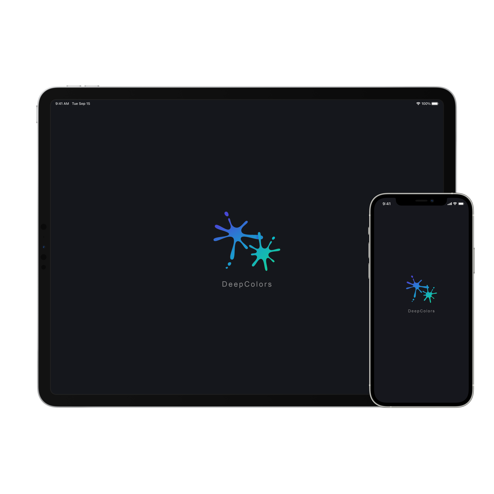
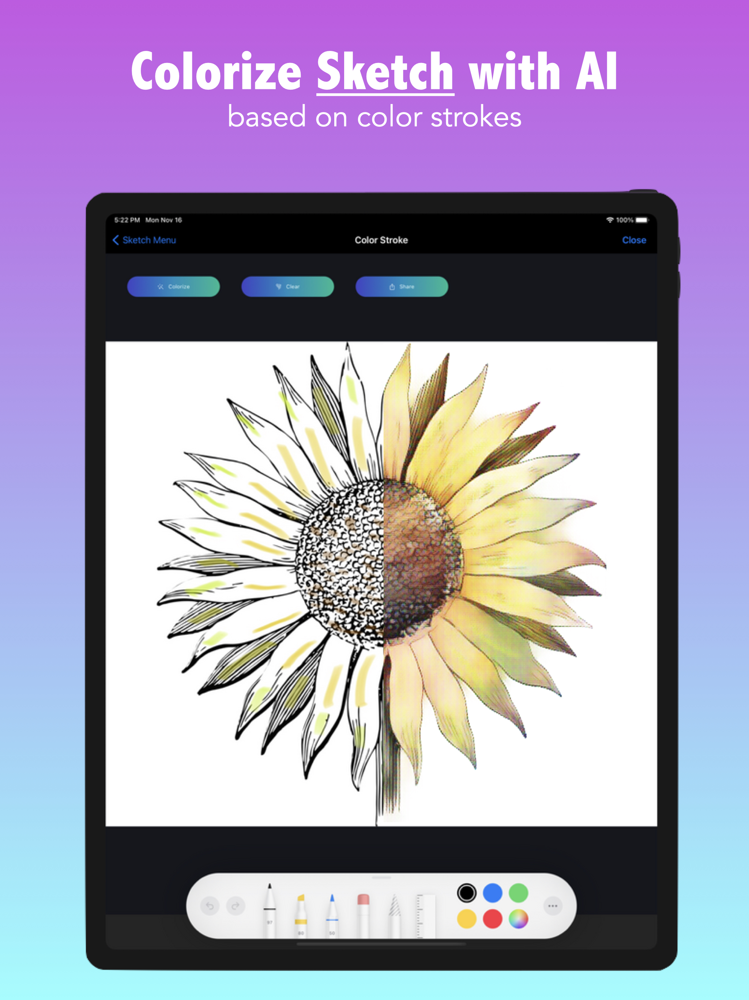
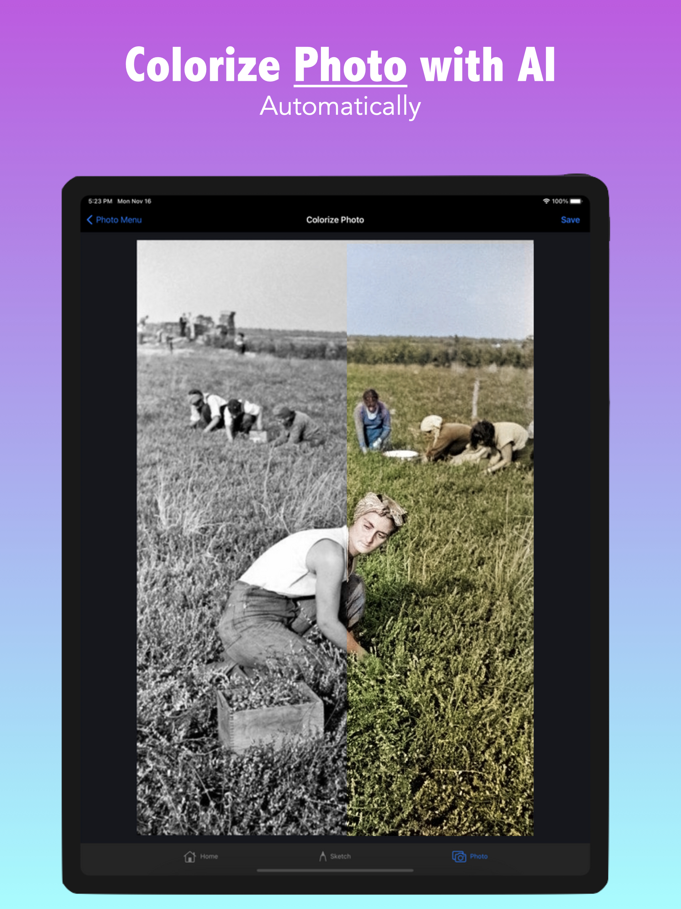

# Kohei Suzuki

- Vancouver based Machine Learning Engineer
- Wesite: https://boblef.github.io/
- Resume: https://boblef.github.io/docs/koheisuzuki_resume2020_ML.pdf
- Contact: kohei.suzuki808@gmail.com

# DeepColors

 

#### About

DeepColors, which is one of my projects, is an iOS app that helps users colorize sketches that they draw and grayscale images, by using DeepLearning.

#### Links

- Download on AppStore: https://apps.apple.com/us/app/deepcolors/id1540025064
- Website: https://www.deepcolors-ai.com/
- Twitter: https://twitter.com/deepcolors_ai
- Youtube: https://www.youtube.com/channel/UCSp_OsSdS20cFiDrDwdI4TA

#### Skills

- Client: SwiftUI, Swift, UIKit
- Backend: Flask, Redis (In-memory database), Ubuntu, GCP, Apache2
- Machine Learning: TensorFlow, PyTorch
- Others:
  - Analytics: Firebase
  - Monetisation: Admob including mediation
  - Marketing: Twitter, Youtube including video editing
  - Web: Bootstrap, html, css, js
